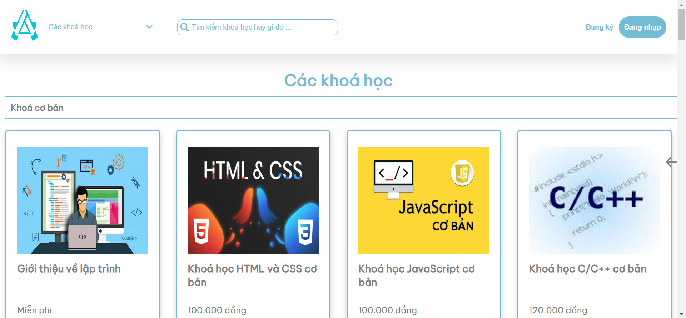
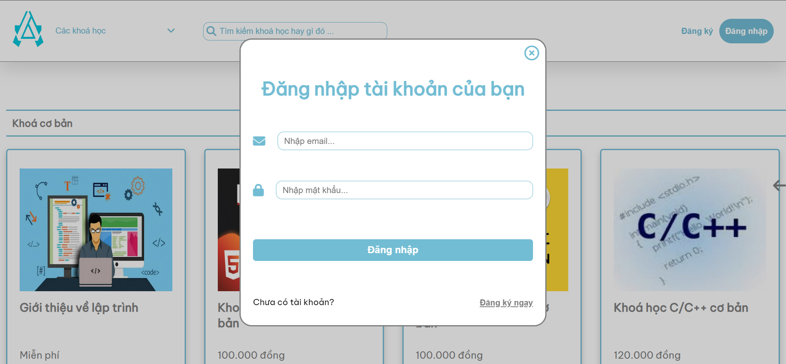
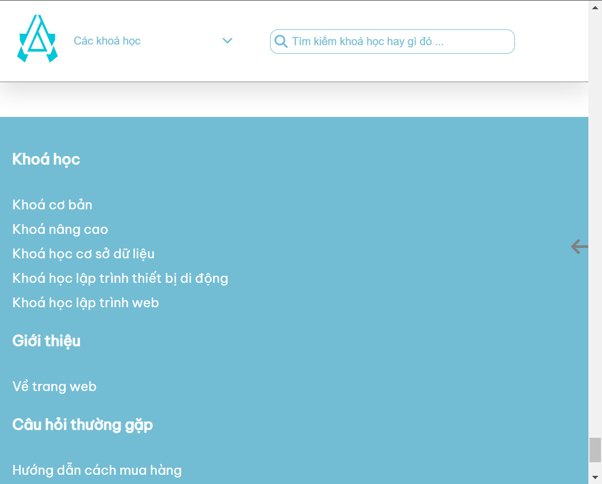

## Responsive Online Courses With Admin Panel

Languages: HTML, CSS, PHP, Javascript. USING PURE AND BASIC FOR ALL.

SPECIAL FEATURE: Notification system between two folders (See more in php/payment/ and admin)

Idea: When we send request to another folder, store the first value to "Notification", and check if the second value is smaller than the first value, then notify it and update it, just like two pointer.

Steps:

1. Create a table named "Notification", store 4 value like FirstCount, SecondCount, ThirdCount, FourthCount.

2. Update table values on user submit.

3. Implement JavaScript function to fetch and announce a message.